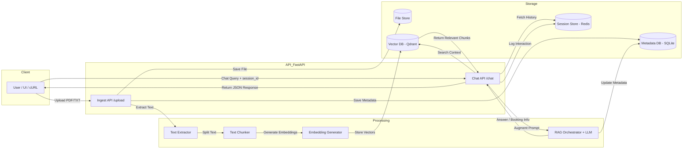

# Enterprise Modular Document Ingestion & Conversational RAG API

[](https://fastapi.tiangolo.com/)
[](https://www.python.org/)
[](https://qdrant.tech/)
[](https://redis.io/)
[](https://groq.com/)
[](https://www.sqlite.org/)

A production-ready, fully asynchronous backend engine built with **FastAPI** for document processing, dense vector indexing, multi-turn conversational RAG (Retrieval-Augmented Generation), and automated intent extraction. The system is built as a set of independently testable services — extraction, chunking, embedding, retrieval, memory, and generation — orchestrated directly by the API layer rather than a high-level chain framework, giving full visibility and control over every step of the pipeline.

## Table of Contents

- [Overview](#overview)
- [Key Features](#key-features)
- [Tech Stack](#tech-stack)
- [System Architecture](#system-architecture)
- [Project Structure](#project-structure)
- [Getting Started](#getting-started)
- [API Reference](#api-reference)
- [Data Model](#data-model)
- [Database Inspection](#database-inspection)
- [Error Handling](#error-handling)
- [Roadmap](#roadmap)
- [Contributing](#contributing)
- [License](#license)
- [Acknowledgments](#acknowledgments)

## Overview

This service exposes two core endpoints — one for ingesting source documents into a searchable vector index, and one for holding grounded, multi-turn conversations over that index. Beyond standard question-answering, the chat endpoint also performs zero-shot intent detection to recognize when a user is trying to schedule an interview, extracting and persisting the relevant details without requiring a separate workflow.

The project favors explicit, hand-rolled orchestration over black-box abstractions: retrieval, prompt construction, and memory management are all implemented directly against their respective clients (Qdrant, Redis, Groq), which keeps latency low and behavior easy to reason about and extend.

## Key Features

**Document ingestion**
- **Multi-format parsing** — safely processes binary `.pdf` uploads via `pypdf` and plain `.txt` files through a unified extraction interface.
- **Collision-safe storage** — every uploaded file is persisted to disk under `storage/uploads/` with a UUID-prefixed filename (`<uuid>_<filename>`) to prevent overwrites.
- **Configurable chunking** — choose between **Recursive Character** and **Standard Character** splitting strategies at request time, with tunable `chunk_size` and `chunk_overlap`.
- **Dense vector indexing** — chunks are embedded with `SentenceTransformer` (`all-MiniLM-L6-v2`) into 384-dimensional vectors and upserted into a local **Qdrant** collection.
- **Relational audit trail** — every ingestion is logged to SQLite via SQLAlchemy, capturing filenames, chunk counts, storage paths, and timestamps.

**Conversational RAG**
- **Custom retrieval pipeline** — similarity search, context formatting, and prompt augmentation are implemented directly, without a high-level chain abstraction such as `RetrievalQAChain`.
- **Multi-turn memory** — a Redis-backed sliding window retrieves and updates session-bound dialogue history on every turn.
- **Low-latency generation** — answers are synthesized by the **Groq API** (`llama-3.3-70b-versatile`), chosen for fast inference relative to standard cloud LLM APIs.

**Automated interview booking**
- **Zero-shot intent detection** — every incoming chat message is evaluated for interview-scheduling intent without any task-specific fine-tuning.
- **Structured extraction** — `name`, `email`, `date`, and `time` are parsed directly out of free-form natural language.
- **Automatic persistence** — confirmed bookings are written straight to the `interview_bookings` table in SQLite, with no extra confirmation step required from the client.

**Developer experience**
- **Interactive API docs** — Swagger UI and ReDoc are generated automatically by FastAPI at `/docs` and `/redoc`.
- **Typed configuration** — all runtime settings are loaded and validated through `pydantic-settings` from a single `.env` file.

## Tech Stack

| Layer | Technology | Purpose |
|---|---|---|
| Web framework | FastAPI | Asynchronous REST API with automatic OpenAPI documentation |
| Language runtime | Python 3.10+ | Core application runtime |
| Vector database | Qdrant | Dense vector storage and similarity search |
| Session store | Redis | Sliding-window, multi-turn chat memory |
| LLM inference | Groq API (`llama-3.3-70b-versatile`) | Answer synthesis and intent detection |
| Embedding model | SentenceTransformers (`all-MiniLM-L6-v2`) | 384-dimensional dense text embeddings |
| Relational database | SQLite + SQLAlchemy | Document metadata and interview booking records |
| PDF parsing | pypdf | Text extraction from PDF uploads |
| Configuration | pydantic-settings | Typed, validated environment configuration |
| DB inspection | Datasette | Local web UI for browsing SQLite data |

## System Architecture



### Document Ingestion Flow

1. The client uploads a `.pdf` or `.txt` file to `POST /api/v1/ingest`.
2. The raw file is written to disk under `storage/uploads/` with a UUID-prefixed name.
3. `text_extractor.py` extracts raw text from the file.
4. `chunker.py` splits the extracted text according to the requested strategy, size, and overlap.
5. `embedder.py` converts each chunk into a 384-dimensional vector.
6. The vectors and their payloads (source chunk, document ID, metadata) are upserted into the Qdrant `documents` collection.
7. A summary record — filename, path, chunk count, and strategy — is written to the `document_metadata` table in SQLite.

### Conversational RAG & Booking Flow

1. The client sends a `session_id` and `message` to `POST /api/v1/chat`.
2. The existing dialogue history for that session is fetched from Redis.
3. The user's message is embedded and used to run a top-K similarity search against Qdrant.
4. The most relevant chunks are returned as retrieved context.
5. The retrieved context, dialogue history, and message are combined into a single prompt sent to the Groq LLM, which simultaneously generates a grounded answer and checks the message for interview-booking intent.
6. If booking intent and complete details (`name`, `email`, `date`, `time`) are found, they are written to the `interview_bookings` table; otherwise, only the contextual answer is returned.
7. The new user/assistant turn is appended back to the session's Redis history.
8. The final JSON response is returned to the client.

## Project Structure

```text
Palm_Mind_Technology/
├── app/
│   ├── api/
│   │   ├── __init__.py
│   │   ├── v1_ingestion.py      # Route: Handles file upload, disk storage, and vector indexing
│   │   └── v1_chat.py           # Route: Manages chat queries, memory, and booking detection
│   ├── models/
│   │   ├── __init__.py
│   │   ├── metadata.py          # SQLAlchemy model: DocumentMetadata
│   │   └── booking.py           # SQLAlchemy model: InterviewBooking
│   ├── schemas/
│   │   ├── __init__.py
│   │   └── chat.py              # Pydantic schemas: Request & response models
│   ├── services/
│   │   ├── __init__.py
│   │   ├── text_extractor.py    # Service: Extracts raw text from PDF/TXT files
│   │   ├── chunker.py           # Service: Text splitting algorithms
│   │   ├── embedder.py          # Service: Generates 384-dim dense vector embeddings
│   │   ├── vector_db.py         # Service: Qdrant client connection & vector search
│   │   ├── redis_memory.py      # Service: Handles Redis sliding-window session context
│   │   └── llm_rag.py           # Service: Groq LLM integration, prompt building, & intent parsing
│   ├── config.py                # Configuration loader via pydantic-settings
│   ├── database.py              # SQLAlchemy engine and session dependency
│   └── main.py                  # FastAPI application entry point & middleware configuration
├── storage/
│   ├── uploads/                 # Persistent local disk directory for raw uploads
│   └── qdrant_storage/          # Persistent local disk storage for the Qdrant collection
├── .env                         # Environment variables and API keys
├── .gitignore                   # Git exclusion rules
├── metadata.db                  # Local SQLite relational database file
└── requirements.txt             # Python project dependencies
```

## Getting Started

### Prerequisites

- Python 3.10 or higher
- A running Redis server reachable on port `6379` (locally installed or via Docker)
- A running Qdrant instance reachable at the URL configured in `QDRANT_URL` (locally installed, via Docker, or Qdrant Cloud)
- A [Groq](https://groq.com/) API key for LLM inference

### Installation

1. **Clone the repository**
   ```bash
   git clone <repository-url>
   cd Palm_Mind_Technology
   ```

2. **Create and activate a virtual environment**
   ```bash
   python3 -m venv api

   # macOS / Linux
   source api/bin/activate

   # Windows
   api\Scripts\activate
   ```

3. **Install dependencies**
   ```bash
   pip install -r requirements.txt
   ```

4. **Configure environment variables**

   Create a `.env` file in the project root (see [Environment Variables](#environment-variables) below for the full reference):
   ```env
   DATABASE_URL=sqlite:///./metadata.db
   HOST=0.0.0.0
   PORT=8000

   GROQ_API_KEY=your_groq_api_key_here
   EMBEDDING_MODEL_NAME=all-MiniLM-L6-v2

   REDIS_HOST=localhost
   REDIS_PORT=6379

   QDRANT_URL=http://localhost:6333
   ```

5. **Start Redis**
   ```bash
   redis-server
   # or, via Docker:
   docker run -p 6379:6379 redis
   ```

6. **Start Qdrant** (if not already running)
   ```bash
   docker run -p 6333:6333 -v "$(pwd)/storage/qdrant_storage:/qdrant/storage" qdrant/qdrant
   ```

7. **Start the FastAPI application**
   ```bash
   uvicorn app.main:app --reload
   ```

   The service starts on `http://127.0.0.1:8000`, with interactive documentation at `http://127.0.0.1:8000/docs`.

### Environment Variables

| Variable | Description | Example |
|---|---|---|
| `DATABASE_URL` | SQLAlchemy connection string for the metadata database | `sqlite:///./metadata.db` |
| `HOST` | Network interface the FastAPI server binds to | `0.0.0.0` |
| `PORT` | Port the FastAPI server listens on | `8000` |
| `GROQ_API_KEY` | API key used to authenticate against the Groq inference API | `your_groq_api_key_here` |
| `EMBEDDING_MODEL_NAME` | SentenceTransformers model used to generate embeddings | `all-MiniLM-L6-v2` |
| `REDIS_HOST` | Hostname of the Redis instance used for session memory | `localhost` |
| `REDIS_PORT` | Port of the Redis instance | `6379` |
| `QDRANT_URL` | Base URL of the Qdrant vector database instance | `http://localhost:6333` |

### Running the Application

For local development, run with auto-reload enabled:
```bash
uvicorn app.main:app --reload
```

For a production-like environment, disable `--reload` and run with multiple workers, for example:
```bash
uvicorn app.main:app --host 0.0.0.0 --port 8000 --workers 4
```

## API Reference

**Base URL:** `http://127.0.0.1:8000`
**Interactive docs:** Swagger UI at [`/docs`](http://127.0.0.1:8000/docs), ReDoc at [`/redoc`](http://127.0.0.1:8000/redoc)

### `POST /api/v1/ingest`

Uploads a document, extracts and chunks its text, generates embeddings, and indexes the result in Qdrant while logging metadata to SQLite.

**Request — `multipart/form-data`**

| Field | Type | Required | Description |
|---|---|---|---|
| `file` | file | Yes | The `.pdf` or `.txt` file to ingest |
| `chunking_strategy` | string | No | `recursive` or `character` |
| `chunk_size` | integer | No | Target number of characters per chunk (e.g. `500`) |
| `chunk_overlap` | integer | No | Number of overlapping characters between consecutive chunks (e.g. `50`) |

**Example request**
```bash
curl -X POST 'http://127.0.0.1:8000/api/v1/ingest' \
  -H 'accept: application/json' \
  -H 'Content-Type: multipart/form-data' \
  -F 'file=@sample.pdf;type=application/pdf' \
  -F 'chunking_strategy=recursive' \
  -F 'chunk_size=500' \
  -F 'chunk_overlap=50'
```

**Response — `201 Created`**
```json
{
  "message": "Document successfully ingested, indexed, and saved to disk.",
  "document_id": "c394a1b0-184e-4f2a-9e12-45e89a2bc112",
  "filename": "sample.pdf",
  "file_path": "storage/uploads/c394a1b0-184e-4f2a-9e12-45e89a2bc112_sample.pdf",
  "chunking_strategy": "recursive",
  "num_chunks": 12,
  "vector_collection": "documents",
  "uploaded_at": "2026-09-17T12:00:00.000000"
}
```

| Response field | Description |
|---|---|
| `document_id` | Unique identifier assigned to the ingested document |
| `filename` | Original filename as uploaded |
| `file_path` | Path where the raw file was persisted on disk |
| `chunking_strategy` | Chunking strategy actually applied |
| `num_chunks` | Number of chunks generated and indexed |
| `vector_collection` | Name of the Qdrant collection the vectors were written to |
| `uploaded_at` | ISO 8601 timestamp of ingestion |

> Uploading a file type other than `.pdf` or `.txt` is rejected, since only those two formats are supported by the extraction pipeline.

### `POST /api/v1/chat`

Handles both grounded document Q&A and interview-booking extraction through a single conversational endpoint. Which behavior applies is decided automatically per message by the underlying intent detection.

**Request — `application/json`**

| Field | Type | Required | Description |
|---|---|---|---|
| `session_id` | string | Yes | Identifier used to key conversation memory in Redis |
| `message` | string | Yes | The user's natural-language message |

**Example — document query**
```json
{
  "session_id": "session_user_001",
  "message": "What are the project deliverables mentioned in the document?"
}
```

**Example — interview booking**
```json
{
  "session_id": "session_user_001",
  "message": "I would like to schedule an interview. Name: Paras Rimal, email: paras@example.com, tomorrow at 3 PM."
}
```

**Example response**
```json
{
  "session_id": "session_user_001",
  "response": "Based on the document, the key deliverables are ...",
  "booking_detected": false
}
```

When booking intent is detected and all required fields are present, the response also includes the extracted details, and the record is persisted to `interview_bookings`:
```json
{
  "session_id": "session_user_001",
  "response": "Thanks, Paras — your interview is scheduled for tomorrow at 3:00 PM. A confirmation will be sent to paras@example.com.",
  "booking_detected": true,
  "booking_details": {
    "name": "Paras Rimal",
    "email": "paras@example.com",
    "date": "2026-09-18",
    "time": "15:00"
  }
}
```

> Exact response field names are illustrative. Confirm the authoritative schema against `app/schemas/chat.py` or the live definitions at `/docs`.

## Data Model

### `document_metadata`

| Column | Type | Description |
|---|---|---|
| `document_id` | string (UUID) | Primary key; unique identifier for the ingested document |
| `filename` | string | Original filename as uploaded |
| `file_path` | string | Path to the stored file on disk |
| `chunking_strategy` | string | Chunking strategy used at ingestion time |
| `num_chunks` | integer | Number of chunks generated and indexed |
| `vector_collection` | string | Qdrant collection the vectors were written to |
| `uploaded_at` | datetime | Timestamp of ingestion |

### `interview_bookings`

| Column | Type | Description |
|---|---|---|
| `id` | integer / UUID | Primary key for the booking record |
| `session_id` | string | Chat session the booking was extracted from |
| `name` | string | Candidate's full name |
| `email` | string | Candidate's email address |
| `date` | string / date | Requested interview date |
| `time` | string / time | Requested interview time |
| `created_at` | datetime | Timestamp the booking was logged |

> These reflect the fields referenced in `app/models/metadata.py` and `app/models/booking.py`; adjust names and types as needed to match your actual SQLAlchemy models.

## Database Inspection

Both `document_metadata` and `interview_bookings` can be browsed through a local, read-only web dashboard using [Datasette](https://datasette.io/):

```bash
datasette metadata.db
```

Then navigate to `http://127.0.0.1:8001`. This is intended for local development and debugging, not as a production admin interface.

## Error Handling

The API follows standard HTTP status code conventions:

| Status | Meaning |
|---|---|
| `200 OK` | Request succeeded |
| `201 Created` | Resource successfully created (e.g., a document was ingested) |
| `400 Bad Request` | Malformed request or unsupported input (e.g., an unsupported file type) |
| `422 Unprocessable Entity` | Request validation failed (FastAPI/Pydantic schema mismatch) |
| `500 Internal Server Error` | An unexpected error occurred while processing the request |

## Roadmap

Potential future enhancements:

- [ ] Docker & Docker Compose setup for one-command startup of the full stack
- [ ] Authentication and per-client API keys
- [ ] Streaming chat responses (Server-Sent Events / WebSockets)
- [ ] Additional ingestion formats (`.docx`, `.md`, `.html`)
- [ ] Automated test suite (`pytest`) and CI pipeline
- [ ] Deployment guidance for scaling Qdrant and Redis horizontally

## Contributing

Contributions are welcome. To propose a change:

1. Fork the repository and create a feature branch: `git checkout -b feature/your-feature-name`
2. Make your changes, following the existing module boundaries under `app/services/`, `app/api/`, and `app/models/`
3. Commit your changes with a clear message and open a pull request describing the motivation and scope of the change

## License

No license has been specified for this project yet. Add a `LICENSE` file to the repository root (for example, MIT, Apache 2.0, or GPL-3.0) and reference it here before distributing or open-sourcing this code.

## Acknowledgments

This project builds on several open-source tools and services:

- [FastAPI](https://fastapi.tiangolo.com/) for the web framework
- [Qdrant](https://qdrant.tech/) for vector search
- [Redis](https://redis.io/) for session memory
- [Groq](https://groq.com/) for low-latency LLM inference
- [SQLite](https://www.sqlite.org/) and SQLAlchemy for relational storage
- [Sentence-Transformers](https://www.sbert.net/) for text embeddings
- [pypdf](https://pypi.org/project/pypdf/) for PDF text extraction
