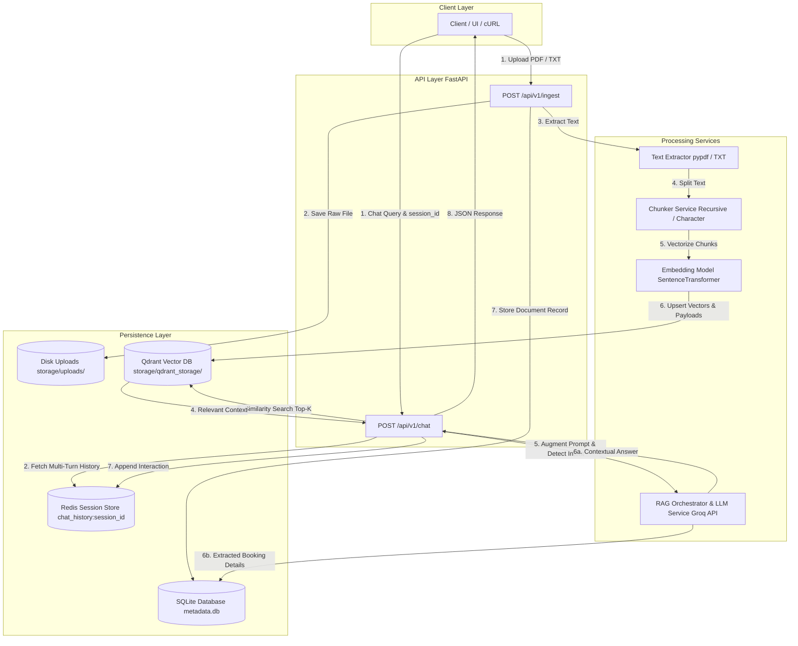

# Enterprise Modular Document Ingestion & Conversational RAG API

[](https://fastapi.tiangolo.com/)
[](https://qdrant.tech/)
[](https://redis.io/)
[](https://groq.com/)
[](https://www.sqlite.org/)

A production-ready, asynchronous backend engine built with **FastAPI** to handle document processing, dense vector indexing, multi-turn conversational RAG (Retrieval-Augmented Generation), and automated intent extraction.

---

## System Architecture & Data Flow



---

## Key Technical Features

### 1. Document Ingestion Pipeline (`POST /api/v1/ingest`)
* **Multi-Format Parsing:** Safely processes binary `.pdf` streams via `pypdf` and plain text `.txt` files.
* **Storage Isolation:** Saves physical uploaded files to disk (`storage/uploads/`) using unique UUID prefixes (`<uuid>_<filename>`) to prevent file overwrite collisions.
* **Configurable Chunking:** Supports runtime selection between **Recursive Character** and **Standard Character** chunking strategies, with customizable `chunk_size` and `chunk_overlap`.
* **Dense Vector Indexing:** Utilizes `SentenceTransformer` (`all-MiniLM-L6-v2`) to convert text chunks into 384-dimensional vector embeddings, persisted locally in **Qdrant**.
* **Relational Tracking:** Logs document upload metadata, chunk counts, and file paths to SQLite via SQLAlchemy.

### 2. Conversational RAG & Memory (`POST /api/v1/chat`)
* **Custom RAG Execution:** Direct retrieval, context formatting, and LLM prompting without high-level chain frameworks like `RetrievalQAChain`.
* **Sliding-Window Memory:** Connects to **Redis** to retrieve and save session-bound dialogue history, maintaining multi-turn context across queries.
* **Low-Latency LLM Inference:** Powered by **Groq API** (`llama-3.3-70b-versatile`) for context augmentation and synthesis.

### 3. Automated Interview Booking Extraction
* **Zero-Shot Intent Detection:** Dynamically evaluates incoming user chat messages to identify interview scheduling requests.
* **Structured Parsing:** Extracts structured fields (`name`, `email`, `date`, `time`) directly from free-form user input.
* **Database Persistence:** Automatically logs confirmed booking records into SQLite (`interview_bookings` table).

---

## Directory Structure & Component Responsibility

```text
Palm_Mind_Technology/
├── app/
│   ├── api/
│   │   ├── __init__.py
│   │   ├── v1_ingestion.py      # Route: Handles file upload, disk storage, and vector indexing
│   │   └── v1_chat.py           # Route: Manages chat queries, memory, and booking detection
│   ├── models/
│   │   ├── __init__.py
│   │   ├── metadata.py          # SQLAlchemy model: DocumentMetadata
│   │   └── booking.py           # SQLAlchemy model: InterviewBooking
│   ├── schemas/
│   │   ├── __init__.py
│   │   └── chat.py              # Pydantic schemas: Request & response models
│   ├── services/
│   │   ├── __init__.py
│   │   ├── text_extractor.py    # Service: Extracts raw text from PDF/TXT files
│   │   ├── chunker.py           # Service: Text splitting algorithms
│   │   ├── embedder.py          # Service: Generates 384-dim dense vector embeddings
│   │   ├── vector_db.py         # Service: Qdrant client connection & vector search
│   │   ├── redis_memory.py      # Service: Handles Redis sliding-window session context
│   │   └── llm_rag.py           # Service: Groq LLM integration, prompt building, & intent parsing
│   ├── config.py                # Configuration loader via pydantic-settings
│   ├── database.py              # SQLAlchemy engine and session dependency
│   └── main.py                  # FastAPI application entry point & middleware configuration
├── storage/
│   ├── uploads/                 # Persistent local disk directory for raw uploads
│   └── qdrant_storage/          # Persistent local disk storage for Qdrant collection
├── .env                         # Environment variables and API keys
├── .gitignore                   # Git exclusion rules
├── metadata.db                  # Local SQLite relational database file
└── requirements.txt             # Python project dependencies
```

---

## Setup & Local Installation

### Prerequisites
* Python 3.10+
* Redis Server running locally on port `6379`

### Installation Steps

1. **Activate Virtual Environment:**
   ```bash
   source api/bin/activate
   ```

2. **Install Dependencies:**
   ```bash
   pip install -r requirements.txt
   ```

3. **Configure Environment Variables (`.env`):**
   ```env
   DATABASE_URL=sqlite:///./metadata.db
   HOST=0.0.0.0
   PORT=8000

   GROQ_API_KEY=your_groq_api_key_here
   EMBEDDING_MODEL_NAME=all-MiniLM-L6-v2

   REDIS_HOST=localhost
   REDIS_PORT=6379

   QDRANT_URL=http://localhost:6333
   ```

4. **Start Redis Server:**
   ```bash
   redis-server
   ```

5. **Start FastAPI Application:**
   ```bash
   uvicorn app.main:app --reload
   ```
   The service will start on `http://127.0.0.1:8000`.

---

## API Usage & Endpoints

Interactive OpenAPI documentation is available at **`http://127.0.0.1:8000/docs`**.

### 1. Document Ingestion
`POST /api/v1/ingest`

**cURL Request:**
```bash
curl -X 'POST'   'http://127.0.0.1:8000/api/v1/ingest'   -H 'accept: application/json'   -H 'Content-Type: multipart/form-data'   -F 'file=@sample.pdf;type=application/pdf'   -F 'chunking_strategy=recursive'   -F 'chunk_size=500'   -F 'chunk_overlap=50'
```

**Response (`201 Created`):**
```json
{
  "message": "Document successfully ingested, indexed, and saved to disk.",
  "document_id": "c394a1b0-184e-4f2a-9e12-45e89a2bc112",
  "filename": "sample.pdf",
  "file_path": "storage/uploads/c394a1b0-184e-4f2a-9e12-45e89a2bc112_sample.pdf",
  "chunking_strategy": "recursive",
  "num_chunks": 12,
  "vector_collection": "documents",
  "uploaded_at": "2026-09-17T12:00:00.000000"
}
```

---

### 2. Conversational RAG & Interview Booking
`POST /api/v1/chat`

**Document Query Payload:**
```json
{
  "session_id": "session_user_001",
  "message": "What are the project deliverables mentioned in the document?"
}
```

**Interview Booking Payload:**
```json
{
  "session_id": "session_user_001",
  "message": "I would like to schedule an interview. Name: Paras Rimal, email: paras@example.com, tomorrow at 3 PM."
}
```

---

## Database Inspection

To view database records (`document_metadata` and `interview_bookings`) in a web dashboard:

```bash
datasette metadata.db
```
Navigate to `http://127.0.0.1:8001` in your browser.
